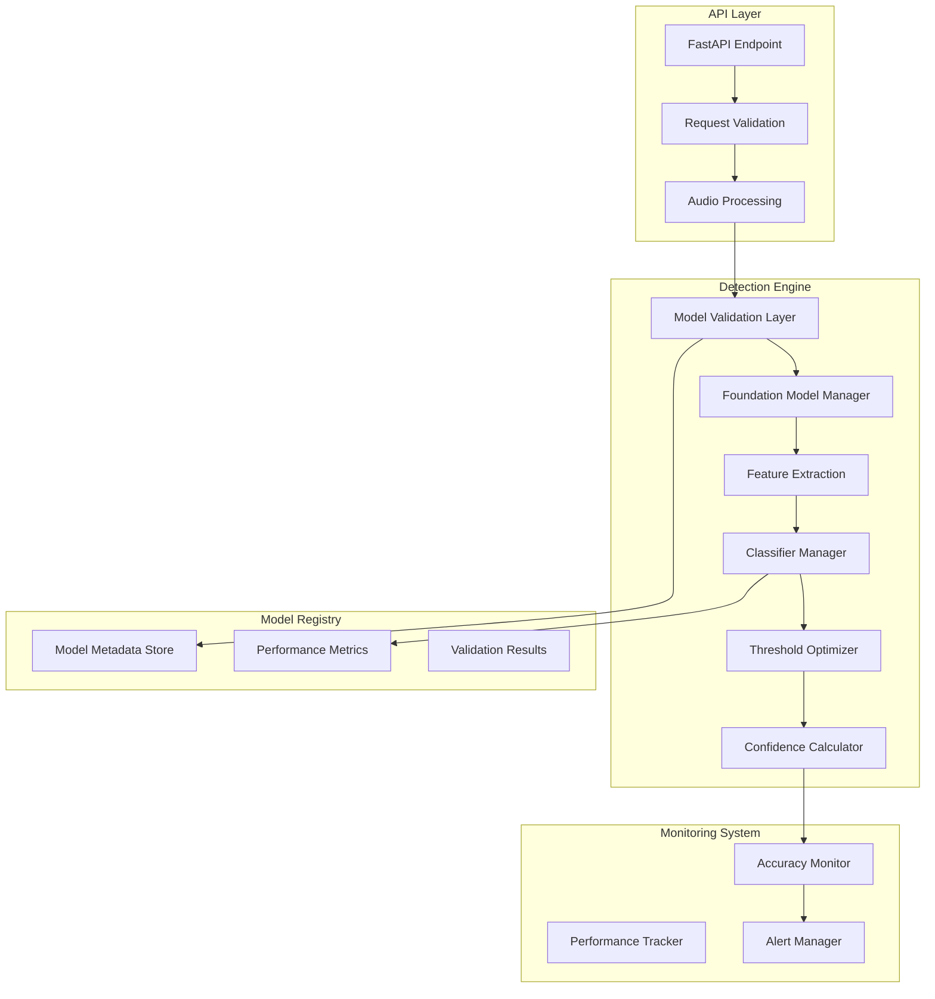
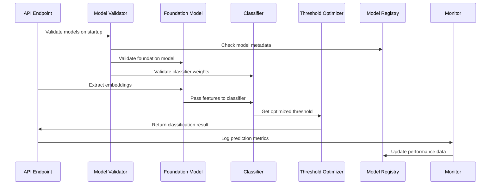

# Design Document: AI Voice Detection Accuracy Improvements

## Overview

This design document outlines the architecture and implementation approach for improving the accuracy of the AI voice detection API. The current system suffers from inconsistent results due to dummy classifiers, random embeddings, and inadequate model validation. This design addresses these issues through systematic model validation, proper foundation model integration, optimized thresholds, and comprehensive monitoring.

The solution focuses on transforming the existing system from a prototype with dummy components into a production-ready system with validated models, consistent results, and robust error handling. Key improvements include eliminating randomness in the inference pipeline, implementing proper model validation, and establishing comprehensive monitoring for accuracy degradation.

## Architecture

### High-Level Architecture



### Component Interaction Flow



## Components and Interfaces

### 1. Model Validation Layer

**Purpose**: Ensures all models are properly trained and functional before use.

**Key Classes**:

```python
class ModelValidator:
    def validate_foundation_model(self, model_path: str) -> ValidationResult
    def validate_classifier(self, classifier_path: str, language: str) -> ValidationResult
    def check_model_weights(self, model: tf.keras.Model) -> bool
    def verify_model_performance(self, model: tf.keras.Model, test_data: np.ndarray) -> float

class ValidationResult:
    is_valid: bool
    confidence_score: float
    error_message: Optional[str]
    performance_metrics: Dict[str, float]
```

**Validation Criteria**:

- Foundation models must load successfully and produce non-random embeddings
- Classifiers must have trained weights (not random initialization)
- Models must meet minimum performance thresholds on validation data
- Model architectures must match expected input/output dimensions

### 2. Foundation Model Manager

**Purpose**: Manages loading, caching, and switching between foundation models with proper validation.

**Key Classes**:

```python
class FoundationModelManager:
    def load_model(self, model_name: str) -> Tuple[Any, Any]
    def extract_embeddings(self, audio: np.ndarray) -> np.ndarray
    def validate_embeddings(self, embeddings: np.ndarray) -> bool
    def switch_model(self, new_model: str) -> None
    def get_fallback_features(self, audio: np.ndarray) -> np.ndarray

class EmbeddingValidator:
    def is_random_embedding(self, embeddings: np.ndarray) -> bool
    def check_embedding_quality(self, embeddings: np.ndarray) -> float
    def validate_consistency(self, audio: np.ndarray, runs: int = 3) -> bool
```

**Features**:

- Deterministic embedding extraction with seed control
- Validation that embeddings are meaningful (not random)
- Graceful fallback to validated backup feature extraction
- Consistency checks across multiple runs with same input

### 3. Classifier Manager

**Purpose**: Manages language-specific classifiers with proper validation and caching.

**Key Classes**:

```python
class ClassifierManager:
    def load_classifier(self, language: str) -> tf.keras.Model
    def validate_classifier_weights(self, model: tf.keras.Model) -> bool
    def get_model_metadata(self, language: str) -> ModelMetadata
    def update_classifier(self, language: str, new_model_path: str) -> None

class ModelMetadata:
    training_date: datetime
    validation_accuracy: float
    test_accuracy: float
    model_version: str
    training_data_hash: str
```

**Validation Process**:

- Check that model weights are not randomly initialized
- Verify model architecture matches expected input dimensions
- Validate performance on known test cases
- Ensure model produces consistent outputs for identical inputs

### 4. Threshold Optimizer

**Purpose**: Calculates and maintains optimal classification thresholds per language and model combination.

**Key Classes**:

```python
class ThresholdOptimizer:
    def calculate_optimal_threshold(self, language: str, validation_data: List[Tuple]) -> float
    def optimize_for_f1_score(self, predictions: np.ndarray, labels: np.ndarray) -> float
    def get_threshold(self, language: str) -> float
    def update_thresholds(self, language: str, new_data: List[Tuple]) -> None

class ThresholdConfig:
    language: str
    threshold: float
    precision: float
    recall: float
    f1_score: float
    last_updated: datetime
```

**Optimization Strategy**:

- Use validation data to find threshold that maximizes F1-score
- Balance precision and recall based on use case requirements
- Support per-language threshold optimization
- Automatic threshold updates when new validation data is available

### 5. Performance Monitor

**Purpose**: Continuously monitors system accuracy and performance metrics.

**Key Classes**:

```python
class AccuracyMonitor:
    def track_prediction(self, prediction: DetectionResult, ground_truth: Optional[str]) -> None
    def calculate_running_accuracy(self, language: str, window_size: int = 1000) -> float
    def detect_accuracy_degradation(self, language: str) -> bool
    def generate_performance_report(self, time_period: timedelta) -> PerformanceReport

class PerformanceReport:
    overall_accuracy: float
    per_language_accuracy: Dict[str, float]
    confidence_distribution: Dict[str, int]
    processing_times: List[float]
    error_rates: Dict[str, float]
```

**Monitoring Features**:

- Real-time accuracy tracking with sliding windows
- Automatic alerts when accuracy drops below thresholds
- Confidence score distribution analysis
- Processing time and resource utilization monitoring

## Data Models

### Enhanced Detection Result

```python
class DetectionResult(BaseModel):
    classification: str  # "AI_GENERATED" or "HUMAN"
    confidence_score: float  # 0.0 to 1.0
    model_version: str
    processing_time: float
    foundation_model: str
    threshold_used: float
    validation_status: str  # "VALIDATED", "FALLBACK", "WARNING"

class ValidationMetrics(BaseModel):
    model_validated: bool
    embedding_quality_score: float
    consistency_score: float
    fallback_used: bool
    validation_timestamp: datetime

class PerformanceMetrics(BaseModel):
    accuracy: float
    precision: float
    recall: float
    f1_score: float
    auc_roc: float
    sample_count: int
    last_updated: datetime
```

### Model Registry Schema

```python
class ModelRecord(BaseModel):
    model_id: str
    model_type: str  # "foundation" or "classifier"
    language: Optional[str]
    version: str
    file_path: str
    training_date: datetime
    validation_metrics: PerformanceMetrics
    status: str  # "ACTIVE", "DEPRECATED", "TESTING"

class ThresholdRecord(BaseModel):
    language: str
    model_version: str
    threshold: float
    optimization_date: datetime
    validation_f1_score: float
```

## Implementation Strategy

### Phase 1: Model Validation Infrastructure

1. **Model Validator Implementation**
   - Create validation logic for foundation models and classifiers
   - Implement weight analysis to detect dummy/random models
   - Add performance benchmarking on known test cases
   - Create validation result reporting and logging

2. **Foundation Model Integration**
   - Fix embedding extraction to use actual foundation models
   - Add embedding quality validation (detect random outputs)
   - Implement deterministic processing with seed control
   - Create fallback mechanisms for model failures

### Phase 2: Consistency and Accuracy Improvements

1. **Eliminate Randomness**
   - Remove all random number generation from inference pipeline
   - Implement deterministic confidence score calculation
   - Add consistency testing across multiple runs
   - Create reproducible feature extraction

2. **Threshold Optimization**
   - Implement per-language threshold calculation
   - Add F1-score optimization algorithms
   - Create threshold update mechanisms
   - Add validation data management

### Phase 3: Monitoring and Alerting

1. **Performance Monitoring**
   - Implement real-time accuracy tracking
   - Add degradation detection algorithms
   - Create performance reporting dashboards
   - Add automated alerting for accuracy drops

2. **Model Registry**
   - Create model metadata storage
   - Implement version tracking and rollback
   - Add A/B testing capabilities for model updates
   - Create model lifecycle management

## Error Handling

### Graceful Degradation Strategy

```python
class FallbackStrategy:
    def handle_foundation_model_failure(self) -> np.ndarray:
        # Use validated traditional audio features (MFCC, spectral)
        # Instead of random embeddings

    def handle_classifier_failure(self, language: str) -> str:
        # Use ensemble of available classifiers
        # Or fall back to rule-based detection

    def handle_low_confidence(self, confidence: float) -> DetectionResult:
        # Mark result as uncertain
        # Provide additional context in response
```

### Error Categories and Responses

1. **Model Loading Errors**
   - Log specific error details
   - Attempt alternative model loading methods
   - Fall back to validated backup models
   - Return clear error messages to users

2. **Inference Errors**
   - Retry with different preprocessing
   - Use ensemble methods when available
   - Provide uncertainty indicators
   - Log errors for system monitoring

3. **Validation Failures**
   - Prevent use of invalid models
   - Alert administrators immediately
   - Use last known good model configuration
   - Provide detailed diagnostic information

## Testing Strategy

### Dual Testing Approach

The testing strategy combines unit tests for specific functionality with property-based tests for comprehensive validation across all inputs.

**Unit Testing Focus**:

- Model validation logic with known good/bad models
- Threshold optimization algorithms with sample data
- Error handling scenarios and edge cases
- Integration points between components
- Specific examples of accuracy improvements

**Property-Based Testing Focus**:

- Universal properties that must hold across all inputs
- Consistency requirements for identical inputs
- Performance characteristics under various conditions
- Comprehensive input coverage through randomization

**Property Test Configuration**:

- Use Hypothesis library for Python property-based testing
- Configure minimum 100 iterations per property test
- Tag each test with feature name and property reference
- Each correctness property implemented by single property-based test

Now I need to use the prework tool to analyze the acceptance criteria before writing the correctness properties section.

## Correctness Properties

_A property is a characteristic or behavior that should hold true across all valid executions of a system—essentially, a formal statement about what the system should do. Properties serve as the bridge between human-readable specifications and machine-verifiable correctness guarantees._

### Property 1: Deterministic Processing Consistency

_For any_ audio sample, processing it multiple times through the detection engine should produce identical classification results, confidence scores, and intermediate features, ensuring complete reproducibility of the inference pipeline.
**Validates: Requirements 2.1, 2.2, 2.4, 2.5**

### Property 2: Model Validation Effectiveness

_For any_ classifier or foundation model, the validation system should correctly identify whether the model is properly trained (non-random weights) versus dummy/randomly initialized, preventing the use of untrained models in production.
**Validates: Requirements 1.2, 4.2**

### Property 3: Graceful Fallback Behavior

_For any_ model failure scenario (foundation model unavailable, classifier loading error, resource constraints), the system should activate validated fallback mechanisms instead of generating random outputs or crashing.
**Validates: Requirements 1.3, 4.3, 6.2, 6.4**

### Property 4: Threshold Optimization Correctness

_For any_ language and validation dataset, the threshold optimizer should calculate thresholds that maximize F1-score and use language-specific values instead of fixed 0.5 thresholds for classification decisions.
**Validates: Requirements 5.1, 5.2, 5.3**

### Property 5: Model Registry Completeness

_For any_ model registered in the system, all required metadata (training date, validation accuracy, performance benchmarks, model lineage) should be present and accessible for tracking and rollback purposes.
**Validates: Requirements 1.5, 8.5**

### Property 6: Error Handling Specificity

_For any_ error condition (model loading failure, feature extraction error, low confidence), the system should provide specific error messages and appropriate uncertainty indicators rather than generic failures.
**Validates: Requirements 6.1, 6.3**

### Property 7: Monitoring Data Completeness

_For any_ processing request, the system should track all required metrics (accuracy, processing time, resource utilization, confidence distribution) and log sufficient information for performance analysis and debugging.
**Validates: Requirements 7.1, 4.5, 6.5**

### Property 8: Alert Triggering Reliability

_For any_ accuracy degradation or performance issue that exceeds defined thresholds, the monitoring system should automatically trigger appropriate alerts and diagnostic procedures.
**Validates: Requirements 3.5, 7.2**

### Property 9: Model Compatibility Validation

_For any_ foundation model switch or classifier update, the system should validate dimensional compatibility and feature consistency to prevent runtime errors from mismatched model architectures.
**Validates: Requirements 4.4**

### Property 10: Confidence Score Meaningfulness

_For any_ model prediction, the confidence score should reflect actual model uncertainty, with ambiguous or edge case samples receiving appropriately lower confidence scores than clear classifications.
**Validates: Requirements 2.3, 3.4**

### Property 11: Model Lifecycle Management

_For any_ model update or retraining event, the system should maintain backward compatibility, support A/B testing comparisons, and provide rollback capabilities while ensuring new models meet accuracy requirements before deployment.
**Validates: Requirements 8.2, 8.3, 8.4**

### Property 12: Foundation Model Utilization

_For any_ available foundation model, the system should load and use it for feature extraction instead of generating dummy embeddings, and verify that extracted embeddings are meaningful rather than random.
**Validates: Requirements 4.1**

## Testing Strategy

### Dual Testing Approach

**Unit Testing Focus**:

- Model validation logic with known good/bad model examples
- Threshold optimization algorithms with sample validation datasets
- Error handling scenarios with specific failure conditions
- Integration points between model validator and detection engine
- Specific examples of accuracy improvements and consistency fixes

**Property-Based Testing Focus**:

- Universal properties that must hold across all valid inputs
- Consistency requirements tested with randomly generated audio samples
- Model validation tested with randomly generated trained/dummy models
- Comprehensive input coverage through randomized test generation
- Fallback behavior tested across various failure scenarios

**Property Test Configuration**:

- Use Hypothesis library for Python property-based testing
- Configure minimum 100 iterations per property test due to randomization
- Tag each test with: **Feature: ai-voice-detection-accuracy, Property {number}: {property_text}**
- Each correctness property implemented by single property-based test
- Focus on testing universal behaviors rather than specific examples

**Testing Balance**:
Unit tests handle specific examples and edge cases, while property tests verify universal correctness across all inputs. Together they provide comprehensive coverage - unit tests catch concrete bugs in specific scenarios, while property tests verify general correctness principles hold across the entire input space.

The property-based tests are particularly valuable for this system because they can detect inconsistencies in model behavior, validate that fallback mechanisms work across various failure modes, and ensure that optimizations like threshold calculation work correctly regardless of the specific validation data provided.
